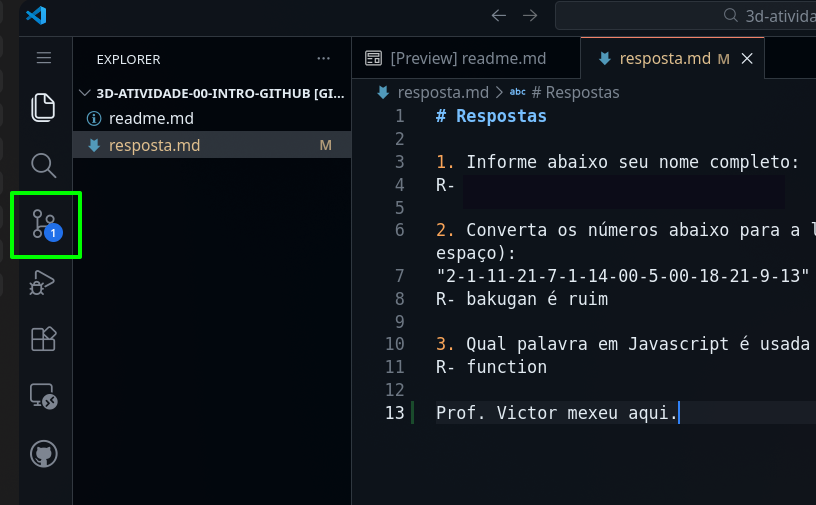

# Atividade de projeto

Sigam as instruções abaixo para a realização das atividades:

- [Arquivos para consulta](#arquivos-para-consulta)
- [Formato da atividade](#formato-da-atividade)
- [Para responder as atividades](#para-responder-as-atividades)

## Arquivos para consulta

A pasta `docs` contém arquivos no formato markdown (igual a este) para consulta, e eles estão divididos em tópicos:

- `tags`: Referência das várias tags html básicas, falando sobre suas funções e quais atributos principais de cada uma. Há uma comparação com o equivalente nas tags html comuns.
- `componentes`: Referência dos componentes já disponibilizados pelo React Native. Fala sobre as funções de cada um e atributos principais. Se houver um componente que faça o mesmo que uma tag em particular, dê preferência a usar o componente.
- `react`: Referência para como funciona o React e o React Native, explicando a lógica, sintaxe e funcionalidades principais.
- `useState`: Referência sobre como funciona gestão de estado no React Native.

## Formato da atividade

A atividade consiste de quatro exercícios onde trabalharemos o conteúdo que foi explicado em aula. Cada questão vale 1/3 da nota total da atividade, ou seja, o aluno precisa acertar apenas 3/4 das questões.

Níveis das questões:
- Uma questão simples
- Uma questão intermediária
- Duas questões um pouco mais complexas

Os arquivos das questões já estão criados dentro da pasta `/src/components/`. Cada arquivo contém a descrição do que deve ser produzido, mas não há nenhum código pois este deve ser completamente feito pelo aluno.

Atenção aos detalhes abaixo:
1. Os componentes são sempre os arquivos existentes na pasta `/src/components/`.
2. Os componentes das questões SEMPRE começam com a palavra `Atv` de `Atividade`.
3. Para testar os componentes, você pode importar eles no arquivo `App.jsx` dentro da pasta `/src/`.
4. Para executar o projeto, abra o terminal na pasta correta (confira com o comando `ls` se a pasta onde você está no terminal exibe as pastas `src`, `assets`, `docs` e `tests`).
5. Se estiver na pasta correta, digite o comando `npm run web` ainda no terminal para executar o projeto.
6. Se não estiver na pasta correta, use no terminal os comandos `cd` para navegar para a pasta desejada, `pwd` para conferir onde você está no momento, e `ls` para conferir o conteúdo da pasta atual. Só execute o comando do passo 4 se estiver na pasta correta.
7. O envio da atividade deve ser feito através do GitHub. Para o envio, siga os passos abaixo.

## Para responder as atividades

1. Cada aluno possui uma "branch" cujo nome corresponde ao nome de usuário de cada aluno. Ao clicar no botão com o texto "master" acima da lista de arquivos deste projeto, aparece um menu onde você deve escolher a "branch" cujo nome é o mesmo que o nome de seu usuário no GitHub.  
  
  

2. Após selecionar sua branch, faça um dos dois passos abaixo (o resultado é o mesmo):
    - Aperte a tecla de ponto final no teclado, uma única vez
    ou
    - Se a opção acima não funcionar, no endereço da página onde tem "github.com" mude o ".com" para ".dev", e mantenha o restante do endereço da mesma forma.
    Ex: "github.com/viccalq/3c-01-variaveis" -> "github.dev/viccalq/3c-01-variaveis"

3. Espere o VSCode online carregar por completo antes de mexer no projeto. Demora um pouco.

4. Confirme se na parte de baixo a esquerda no VSCode online o nome da branch é o mesmo que o nome de seu usuário. Se não for, clique no nome que aparece na branch, e no menu que aparecer selecione a sua branch.  
  

5. As instruções para as atividades se encontram na sessão anterior (Formato dos exercícios). Quando terminar, volte para o passo 6 desta sessão.

6. Para salvar as modificações e enviar a atividade, clique no terceiro botão dos ícones na borda esquerda do VSCode para abrir um outro menu.  
  

7. Feche a mensagem que aparece sobre o commit.  
  

8. Escreva uma mensagem informando quais exercícios você respondeu da lista. Exemplo: "Respondidos os exercícios 1, 4, 5 e 7".  
  

9. Clique no botão "Commit & push" e espere um pouco. Após o botão ficar desabilitado, a atividade foi enviada.  
  

